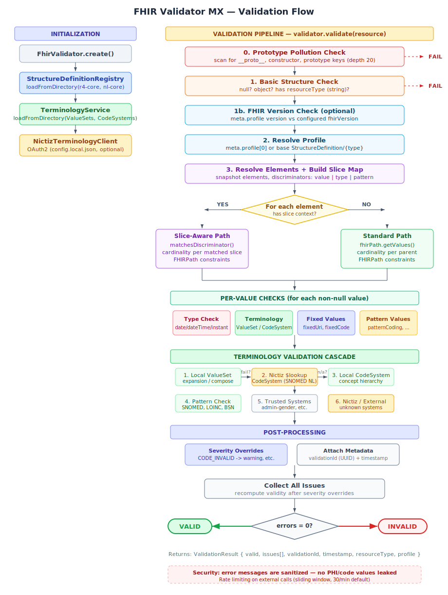

# fhir-validator-mx

A TypeScript/Node.js library for validating FHIR R4 resources against StructureDefinition profiles, with support for Dutch (nl-core) healthcare standards and the Nictiz terminologieserver.

## Features

- **Profile-based validation** — validate resources against FHIR StructureDefinition profiles (snapshot and differential)
- **Cardinality checks** — enforces min/max element constraints
- **Type validation** — verifies FHIR primitive and complex types including date/dateTime/instant/time format validation
- **Terminology binding** — validates codes against ValueSets and CodeSystems (local + art-decor + Nictiz + optional external tx server)
- **Art-decor auto-resolution** — automatically fetches missing ValueSets and CodeSystems from `decor.nictiz.nl` at runtime
- **Nictiz terminologieserver** — OAuth2 integration with the Dutch national terminology server for SNOMED CT NL validation
- **Extensible binding support** — codes from systems outside the ValueSet are accepted for extensible/preferred bindings (FHIR spec)
- **System aliases** — maps well-known OID URNs to canonical HL7 URLs (e.g. `urn:oid:1.0.639.1` to `iso639-1`)
- **FHIRPath constraints** — evaluates FHIRPath invariant expressions
- **Slicing support** — handles discriminated slicing (value, type, pattern discriminators)
- **Fixed & pattern value checks** — enforces fixedCoding, patternIdentifier, etc.
- **Multi-directory loading** — load profiles and terminology from multiple directories in order (base first, overlays second)
- **BSN elfproef** — validates Dutch citizen service numbers using the 11-test algorithm
- **Security** — prototype pollution detection, error message sanitization (no PHI leakage)
- **Configurable severity** — override issue severity per code (e.g. downgrade CODE_INVALID to warning)
- **FHIR version check** — reject resources with incompatible FHIR version in meta.profile
- **Rate limiting** — sliding window rate limit on external terminology calls
- **Batch validation** — validate multiple resources in a single call
- **Validation metadata** — each result includes a unique `validationId` (UUID) and `timestamp`

## Validation Flow



## Installation

```bash
npm install
```

## Quick Start

```typescript
import { FhirValidator } from 'fhir-validator-mx';

const validator = await FhirValidator.create({
  profilesDirs: ['profiles/r4-core', 'profiles/nl-core'],
  terminologyDirs: ['terminology/r4-core', 'terminology/nl-core'],
});

const result = await validator.validate({
  resourceType: 'Patient',
  identifier: [{ system: 'http://fhir.nl/fhir/NamingSystem/bsn', value: '999911120' }],
  name: [{ family: 'Jansen', given: ['Jan'] }],
  gender: 'male',
});

console.log(result.valid);        // true or false
console.log(result.validationId); // "a1b2c3d4-..."
console.log(result.issues);      // ValidationIssue[]
```

### With Nictiz Terminologieserver

The validator can fall back to the Dutch national terminology server for codes that can't be validated locally (e.g. SNOMED CT codes referenced by broad ValueSets like `observation-codes`).

```typescript
const config = await FhirValidator.loadConfig('config.local.json');

const validator = await FhirValidator.create({
  profilesDirs: ['profiles/r4-core', 'profiles/nl-core'],
  terminologyDirs: ['terminology/r4-core', 'terminology/nl-core'],
  terminology: {
    nictiz: config?.terminology,
  },
});
```

Copy `config.example.json` to `config.local.json` and fill in your Nictiz credentials. This file is gitignored.

### Severity Overrides

```typescript
const validator = await FhirValidator.create({
  profilesDirs: ['profiles/r4-core'],
  terminologyDirs: ['terminology/r4-core'],
  severityOverrides: {
    CODE_INVALID: 'warning', // downgrade binding errors to warnings
  },
});
```

### Programmatic Registration

```typescript
const validator = await FhirValidator.create();

validator.registerProfile({
  resourceType: 'StructureDefinition',
  url: 'http://example.org/fhir/StructureDefinition/MyPatient',
  name: 'MyPatient',
  status: 'active',
  kind: 'resource',
  abstract: false,
  type: 'Patient',
  snapshot: { element: [/* ... */] },
});

validator.terminology.registerValueSet({
  resourceType: 'ValueSet',
  url: 'http://hl7.org/fhir/ValueSet/administrative-gender',
  status: 'active',
  compose: { include: [/* ... */] },
});
```

## API

### `FhirValidator.create(options?)`

Factory method that creates a validator and loads profiles/terminology.

| Option | Type | Description |
|---|---|---|
| `profilesDirs` | `string[]` | Directories containing StructureDefinition JSON files |
| `terminologyDirs` | `string[]` | Directories containing ValueSet/CodeSystem JSON files |
| `terminology.nictiz` | `NictizTerminologyConfig` | Nictiz terminologieserver credentials |
| `terminology.externalTxServer` | `string` | External terminology server URL (e.g. `https://tx.fhir.org/r4`) |
| `terminology.externalTimeoutMs` | `number` | Timeout for external calls (default: 5000) |
| `terminology.externalRateLimit` | `number` | Max external requests per minute (default: 30) |
| `terminology.disableExternalCalls` | `boolean` | Block all external terminology calls |
| `terminology.artDecor.baseUrl` | `string` | Art-decor FHIR base URL (default: `https://decor.nictiz.nl/fhir`) |
| `terminology.artDecor.timeoutMs` | `number` | Art-decor fetch timeout (default: 10000) |
| `terminology.artDecor.disabled` | `boolean` | Disable art-decor auto-resolution |
| `severityOverrides` | `Record<string, IssueSeverity>` | Override severity per issue code |
| `fhirVersion` | `string` | Accepted FHIR version (e.g. `"4.0.1"`) |

### `FhirValidator.loadConfig(path)`

Loads terminology credentials from a JSON file. Returns `null` if the file does not exist.

### `validator.validate(resource, profileUrl?)`

Returns a `ValidationResult`:

```typescript
interface ValidationResult {
  valid: boolean;
  issues: ValidationIssue[];
  resourceType?: string;
  profile?: string;
  validationId?: string;
  timestamp?: string;
}

interface ValidationIssue {
  severity: 'error' | 'warning' | 'information';
  path: string;
  message: string;
  code?: string;
  expression?: string;
}
```

### `validator.validateBatch(resources)`

Validates an array of resources in parallel.

### `validator.stats()`

Returns counts of loaded profiles, ValueSets, CodeSystems, cached terminology lookups, and whether Nictiz is configured.

## Terminology Validation Cascade

When validating a code, the terminology service uses the following cascade:

1. **Local ValueSet** — check expansion or compose against locally loaded ValueSets
2. **Art-decor auto-fetch** — if the ValueSet URL is from `decor.nictiz.nl`, fetch and register it (with its CodeSystems)
3. **Extensible binding check** — for extensible/preferred bindings, accept codes from systems not in the ValueSet
4. **Trusted system check** — accept codes from well-known systems when no CodeSystem is available to validate against
5. **Nictiz fallback** — if local validation fails, try the Nictiz `CodeSystem/$lookup` endpoint
6. **Local CodeSystem** — validate directly against a locally loaded CodeSystem
7. **Art-decor CodeSystem** — for `urn:oid:` systems, search art-decor for the CodeSystem
8. **Pattern validation** — format checks for known systems (SNOMED, LOINC, BSN elfproef, AGB-Z, UZI, NPI)
9. **Trusted systems** — always accept codes from well-known FHIR systems (administrative-gender, etc.)
10. **Nictiz CodeSystem** — for completely unknown systems, try Nictiz
11. **Skip** — if nothing can validate the code, accept it with a message

### System Aliases

The validator maps well-known OID URNs to their canonical HL7 URLs before validation:

| OID | Canonical URL |
|---|---|
| `urn:oid:1.0.639.1` | `http://terminology.hl7.org/CodeSystem/iso639-1` |
| `urn:oid:2.16.840.1.113883.6.121` | `http://terminology.hl7.org/CodeSystem/iso639-2` |

This ensures that Dutch FHIR resources using OID-based system URLs match ValueSets that reference the canonical HL7 URLs.

## Resource Files

The validator needs FHIR StructureDefinitions, ValueSets, and CodeSystems as JSON files to validate against. These are **included in the npm package** but can also be downloaded manually.

### Directory Layout

```
profiles/r4-core/     -- Base FHIR R4 StructureDefinitions (658 files)
profiles/nl-core/     -- nl-core profile overlays (164 files)
terminology/r4-core/  -- Base FHIR R4 ValueSets and CodeSystems (2378 files)
terminology/nl-core/  -- nl-core terminology (8 files)
```

Directories are loaded in order — base definitions first so that profile overlays can inherit from them.

### Downloading FHIR R4 Core Definitions

Download the official HL7 FHIR R4 definitions package and extract the JSON files:

```bash
# Download the FHIR R4 definitions
curl -LO https://hl7.org/fhir/R4/definitions.json.zip

# Extract StructureDefinitions into profiles/r4-core/
mkdir -p profiles/r4-core
unzip -j definitions.json.zip "profiles-resources.json" "profiles-types.json" -d /tmp/fhir-r4
# Each file contains a Bundle — extract individual StructureDefinitions:
node -e "
  const fs = require('fs');
  for (const f of ['profiles-resources', 'profiles-types']) {
    const bundle = JSON.parse(fs.readFileSync('/tmp/fhir-r4/' + f + '.json', 'utf8'));
    for (const entry of bundle.entry || []) {
      const r = entry.resource;
      if (r.resourceType === 'StructureDefinition') {
        fs.writeFileSync('profiles/r4-core/StructureDefinition-' + r.id + '.json', JSON.stringify(r, null, 2));
      }
    }
  }
"

# Extract ValueSets and CodeSystems into terminology/r4-core/
mkdir -p terminology/r4-core
unzip -j definitions.json.zip "valuesets.json" -d /tmp/fhir-r4
node -e "
  const fs = require('fs');
  const bundle = JSON.parse(fs.readFileSync('/tmp/fhir-r4/valuesets.json', 'utf8'));
  for (const entry of bundle.entry || []) {
    const r = entry.resource;
    if (r.resourceType === 'ValueSet') {
      fs.writeFileSync('terminology/r4-core/ValueSet-' + r.id + '.json', JSON.stringify(r, null, 2));
    } else if (r.resourceType === 'CodeSystem') {
      fs.writeFileSync('terminology/r4-core/CodeSystem-' + r.id + '.json', JSON.stringify(r, null, 2));
    }
  }
"
```

### Downloading nl-core Profiles

The Dutch nl-core profiles are published by Nictiz as npm packages on the Simplifier registry:

```bash
# Download the nl-core package from Simplifier
npm --registry https://packages.simplifier.net pack nictiz.fhir.nl.r4.nl-core

# Extract StructureDefinitions
mkdir -p profiles/nl-core
tar xzf nictiz.fhir.nl.r4.nl-core-*.tgz
node -e "
  const fs = require('fs');
  const dir = 'package/examples'; // or 'package' depending on package version
  // Copy StructureDefinitions
  for (const f of fs.readdirSync('package')) {
    if (!f.endsWith('.json')) continue;
    try {
      const r = JSON.parse(fs.readFileSync('package/' + f, 'utf8'));
      if (r.resourceType === 'StructureDefinition') {
        fs.copyFileSync('package/' + f, 'profiles/nl-core/' + f);
      } else if (r.resourceType === 'ValueSet') {
        fs.mkdirSync('terminology/nl-core', {recursive: true});
        fs.copyFileSync('package/' + f, 'terminology/nl-core/' + f);
      } else if (r.resourceType === 'CodeSystem') {
        fs.mkdirSync('terminology/nl-core', {recursive: true});
        fs.copyFileSync('package/' + f, 'terminology/nl-core/' + f);
      }
    } catch {}
  }
"
rm -rf package nictiz.fhir.nl.r4.nl-core-*.tgz
```

### Using Custom Profiles

You can point the validator at any directory containing FHIR JSON files. For example, to add your own organization's profiles:

```typescript
const validator = await FhirValidator.create({
  profilesDirs: [
    'profiles/r4-core',
    'profiles/nl-core',
    'profiles/my-organization',  // your custom profiles
  ],
  terminologyDirs: [
    'terminology/r4-core',
    'terminology/nl-core',
    'terminology/my-organization',  // your custom ValueSets/CodeSystems
  ],
});
```

The validator recursively scans all subdirectories for `.json` files.

## Development

```bash
npm run build        # Webpack bundle + type declarations
npm run build:js     # Webpack bundle only
npm run build:types  # Type declarations only
npm test             # Run tests (30 tests)
npm run dev          # Run via ts-node
npm run lint         # ESLint
```

## License

ISC
